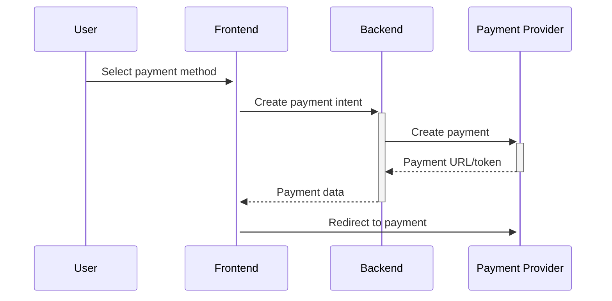

# Payment Flow Documentation

## Overview
The payment system handles all financial transactions including lesson payments, package purchases, and refunds. It supports multiple payment methods with secure processing.

## Payment States

| State | Description |
|-------|-------------|
| `pending` | Payment initiated but not completed |
| `processing` | Payment is being processed |
| `completed` | Payment successfully processed |
| `failed` | Payment failed |
| `refunded` | Payment was refunded |
| `partially_refunded` | Partial refund issued |

## Core Components

### 1. Payment Service
- Handles payment processing
- Routes to appropriate payment provider
- Manages payment callbacks
- Updates booking status

### 2. Payment Providers
- **Swish**: Mobile payments
- **Qliro**: Installment payments
- **Invoice**: Manual payment
- **Credit**: Uses user's credits

### 3. Transaction Logging
- Records all payment attempts
- Stores provider responses
- Enables reconciliation

## Database Tables

### `payments`
- `id` (uuid): Unique payment ID
- `bookingId` (uuid, FK): Related booking
- `userId` (uuid, FK): Payer
- `amount` (decimal): Payment amount
- `currency` (varchar): Currency code (SEK)
- `method` (enum): Payment method
- `status` (enum): Payment state
- `providerId` (varchar): External reference
- `metadata` (jsonb): Additional data
- `createdAt` (timestamp)
- `updatedAt` (timestamp)

### `invoices`
- `id` (uuid)
- `paymentId` (uuid, FK)
- `invoiceNumber` (varchar)
- `dueDate` (date)
- `status` (enum)
- `pdfUrl` (varchar)

## Payment Flow

### 1. Initiation

### 2. Processing
- User completes payment on provider's page
- Provider sends webhook on completion
- System verifies payment
- Updates booking and payment status
- Sends confirmation email

### 3. Completion
- Mark booking as confirmed
- Generate invoice (if applicable)
- Update user credits (for packages)
- Send booking confirmation

## Error Handling

### Common Errors
- **Insufficient Funds**: Prompt for different method
- **Payment Declined**: Show error message
- **Network Issues**: Retry mechanism
- **Timeout**: Check payment status

### Reconciliation
- Daily sync with payment providers
- Flag discrepancies
- Manual review queue

## Security

### PCI Compliance
- No sensitive data storage
- Token-based payments
- Regular security audits

### Data Protection
- Encrypt payment data
- Mask sensitive information
- Log minimal required data

## Testing

### Test Cards
- **Swish Test**: Use test phone numbers
- **Qliro Test**: Test credentials
- **Card Payments**: Test card numbers

### Test Scenarios
1. **Successful Payment**
   - Complete flow
   - Verify booking
   - Check email

2. **Failed Payment**
   - Decline card
   - Check error handling
   - Verify no booking

3. **Partial Refund**
   - Process refund
   - Verify amounts
   - Check status updates
